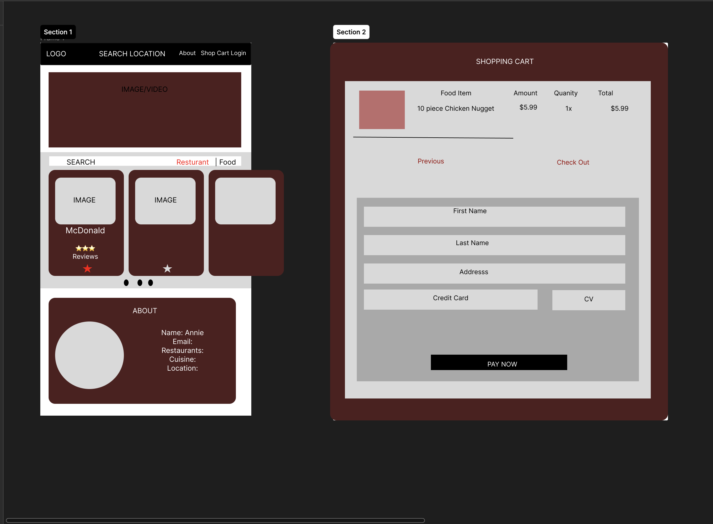

## AAAS-MobileChef

## Table of Contents

- [Installation](#installation)
- [Usage](#usage)
- [Credits](#credits)
- [License](#license)
- [Contact](#contact)

## Description

This is an app that allows users search for fast-food chains near you and view their menu. This app also can save specific favriotes foods to a database so you can acsess those items from favroited items that can be accesed from your account. This also stores credit card information for quick checkouts.

## Live link

https://mobilechef-2efd1b941ab6.herokuapp.com/

## Usage

1 Home ( No login require)
2 Sign in & sign up
3 view resturants options (log in required)
4 order foods (log in required)
5 check out cart (log in required)
6 log out

## Technologies Used

Formater: Cleave.js

API: Mysql MobileChef

## Mock-Ups

We made a mock of Mobile Chef in Figma.

## Screenshots

## Contact Us

Shawn Kim, Email:kimshawnj@gmail.com, Github: Ardvark121

Abigail Peloquin, Email:abigail.turnwall@gmail.com, Github: abigailjoy93

Andy Granda, Email:gayk.william@gmail.com, Github: andgrand1

Annie Bui, Email:buixx185@gmail.com, Github: simplyannzz
